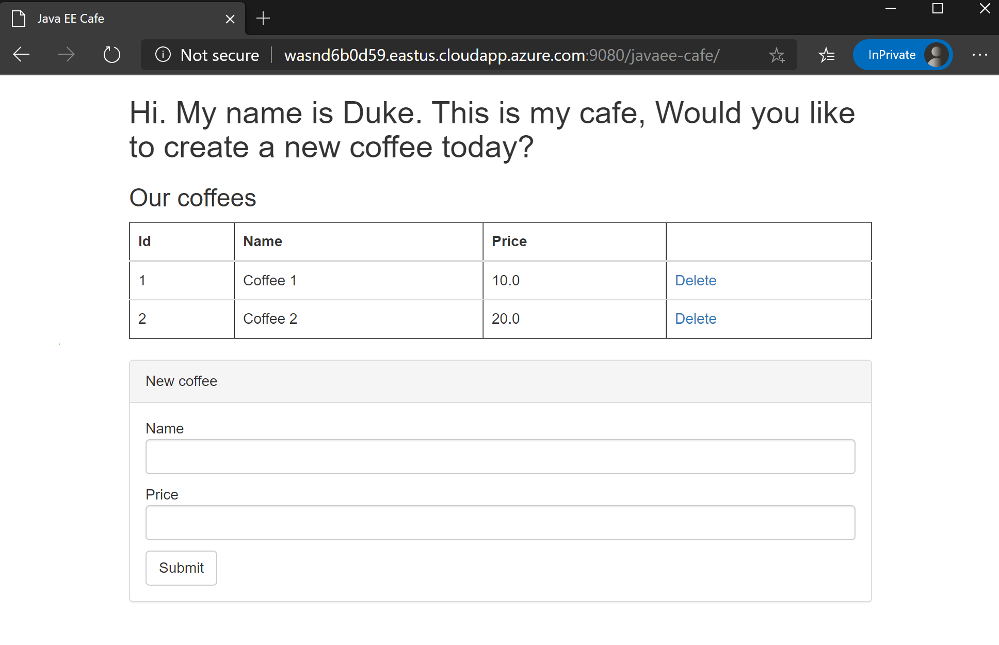

# Deploy Open Liberty Application on Azure Red Hat OpenShift
This guide demonstrates how to run your Java EE application on Open Liberty runtime and then deploy the containerized applicatoin to Azure Red Hat OpenShift (ARO) cluster using Open Liberty Operator. After going through this guide, you will learn steps about preparing Open Liberty Application, building application image & running containerzed application on ARO.
- Introduction for Open Liberty
- Introduction for Azure Red Hat OpenShift

## Prerequisites
- Install JDK per your needs (e.g., [AdoptOpenJDK OpenJDK 8 LTS/OpenJ9](https://adoptopenjdk.net/?variant=openjdk8&jvmVariant=openj9))
- Install [Maven](https://maven.apache.org/download.cgi)
- Install [Docker](https://docs.docker.com/get-docker/) for your OS
- Install [Azure CLI](https://docs.microsoft.com/en-us/cli/azure/install-azure-cli?view=azure-cli-latest)
- Register an Azure subscription. If you don't have one, you can get one for free for one year [here](https://azure.microsoft.com/en-us/free)
- Clone this repo to your local directory

## Set up Azure Red Hat OpenShift cluster
- [Create an Azure Red Hat OpenShift 4 cluster](https://docs.microsoft.com/en-us/azure/openshift/tutorial-create-cluster)
- [Connect to an Azure Red Hat OpenShift 4 cluster](https://docs.microsoft.com/en-us/azure/openshift/tutorial-connect-cluster)
- Install Open Liberty Operator

## Prepare your Open Liberty application
In case you already have a Java EE applicatoin running on Java EE Application Server (e.g., WebSphere, WebLogic, JBoss, etc.), it's easy to make it run on Open Liberty server with minimum changes.

### A basic Java EE app for quick start
Navigate to [`<path-to-repo>/javaee-cafe/1-start`](https://github.com/majguo/open-liberty-demo/tree/master/javaee-cafe/1-start) of your local clone and find out the sample app we prepared for your quick start. It's a basic Java EE application and simple CRUD application. It uses Maven and Java EE 8 (JAX-RS, EJB, CDI, JSON-B, JSF, Bean Validation). Here is brief introduction for the project structure:
```
├── pom.xml                                         # Maven POM file
└── src
    ├── main
    │   ├── java
    │   │   └── cafe
    │   │       ├── model
    │   │       │   ├── CafeRepository.java         # Cafe CRUD repository (in-memory)
    │   │       │   └── entity
    │   │       │       └── Coffee.java             # Coffee entity
    │   │       └── web
    │   │           ├── rest
    │   │           │   └── CafeResource.java       # Cafe CRUD REST APIs
    │   │           └── view
    │   │               └── Cafe.java               # Cafe bean in JSF client
    │   ├── resources
    │   │   ├── META-INF
    │   │   └── cafe
    │   │       └── web
    │   │           ├── messages.properties         # Resource bundle in EN
    │   │           └── messages_es.properties      # Resource bundle in ES
    │   └── webapp
    │       ├── WEB-INF
    │       │   ├── faces-config.xml                # JSF configuration file sepcifying resource bundles and suported locales
    │       │   └── web.xml                         # Deployment descriptor for a Servlet-based Java web application
    │       └── index.xhtml                         # Home page of JSF client
    └── test
        └── java                                    # Placeholder for tests
```

Follow the steps below to package and deploy the application to your desired Java EE Application Server
- Run `mvn clean package`, which will generate a war package `javaee-cafe.war` under `./target`
- Deploy `./target/javaee-cafe.war` to one Java EE Application Server per its specific steps
- Visit the application in your browser. Below is the screenshot of application home page:


### Configure app to run on Open Liberty server
In order to run the application on Open Liberty server, the only mandatory step is to add a server configuratoin file `server.xml`:
```
<?xml version="1.0" encoding="UTF-8"?>
<server description="defaultServer">
	<!-- Enable features -->
	<featureManager>
		<feature>cdi-2.0</feature>
        <feature>jaxb-2.2</feature>
        <feature>jsf-2.3</feature>
        <feature>jaxrs-2.1</feature>
        <feature>ejbLite-3.2</feature>
	</featureManager>

	<!-- Define http & https endpoints -->
	<httpEndpoint id="defaultHttpEndpoint" host="*"
		httpPort="9080" httpsPort="9443" />

	<!-- Automatically expand WAR files and EAR files -->
	<applicationManager autoExpand="true" />

	<!-- Define web application with its context root and location -->
	<webApplication id="javaee-cafe" contextRoot="/"
		location="${server.config.dir}/apps/javaee-cafe.war">
	</webApplication>
</server>
```
It's recommended to add this configuration file to `<path-to-repo>/javaee-cafe/1-start/src/main/liberty/config` (create directories if they don't exist before), as it can perfectly work with `liberty-maven-plugin` which makes develop Open Liberty applicatoin easy.

TODO: add `liberty-maven-plugin` to pom.xml

## Deploy application on ARO
- Build application image with [Open Liberty container images](https://github.com/OpenLiberty/ci.docker)
- OpenLibertyApplication yaml
- Deploy from GUI
- Deploy from CLI

## Integrate with Azure services
### Enable Signle-Sign-On with Azure Active Directory OpenID Connect

### Persist data with Azure Database for PostgreSQL

### Ship application log to managed Elasticsearch service on Azure

## References
- [Open Liberty server configuration](https://openliberty.io/docs/ref/config/)
