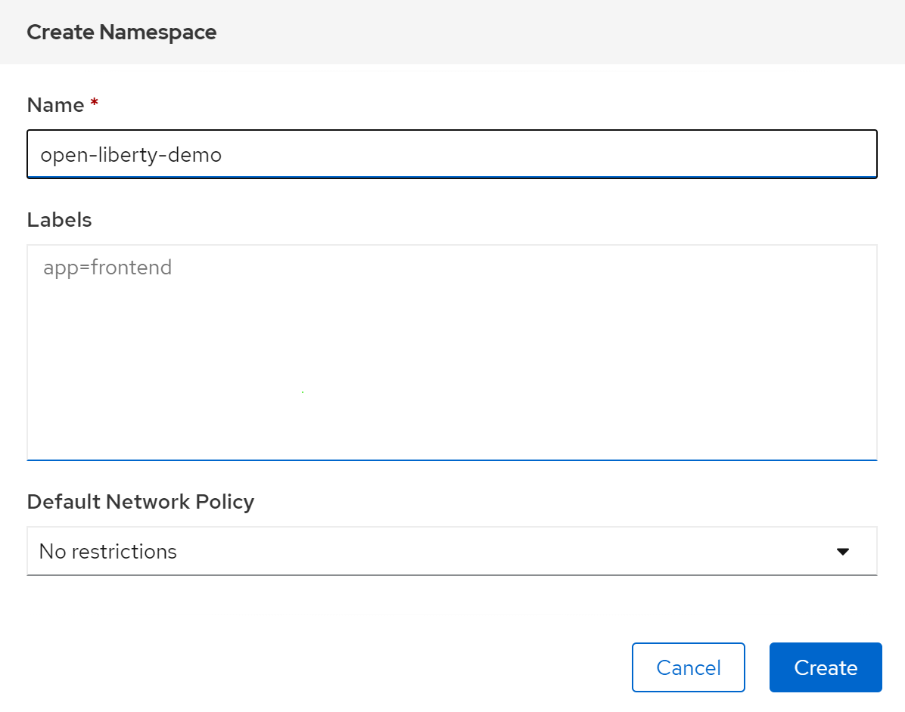
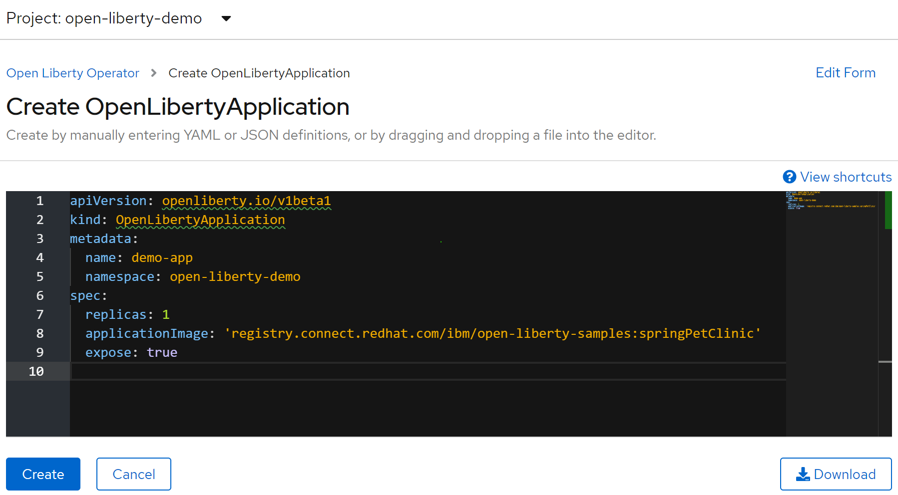

# Deploy Open Liberty Application on Azure Red Hat OpenShift
This guide demonstrates how to run your Java EE application on Open Liberty runtime and then deploy the containerized applicatoin to Azure Red Hat OpenShift (ARO) cluster using Open Liberty Operator. After going through this guide, you will learn steps about preparing Open Liberty Application, building application image & running containerzed application on ARO.
- Introduction for [Open Liberty](https://openliberty.io/): Open Liberty is an IBM Open Source project which implementes Eclipse MicroProfile specifications and is also Jakarta EE compatibale. Open Liberty is fast to start up with a low memory footprint and live reload for quick iteration. Simple to add and remove features from the latest versions of MicroProfile and Jakarta EE. Zero migration lets you focus on what's important, not the APIs changing under you. 
- Introduction for [Azure Red Hat OpenShift](https://azure.microsoft.com/en-us/services/openshift/): Azure Red Hat OpenShift provides a flexible, self-service deployment of fully managed OpenShift clusters. Maintain regulatory compliance and focus on your application development, while your master, infrastructure, and application nodes are patched, updated, and monitored by both Microsoft and Red Hat.

## Prerequisites
- Install JDK per your needs (e.g., [AdoptOpenJDK OpenJDK 8 LTS/OpenJ9](https://adoptopenjdk.net/?variant=openjdk8&jvmVariant=openj9))
- Install [Maven](https://maven.apache.org/download.cgi)
- Install [Docker](https://docs.docker.com/get-docker/) for your OS
- Register a [Docker Hub](https://id.docker.com/) account
- Install [Azure CLI](https://docs.microsoft.com/en-us/cli/azure/install-azure-cli?view=azure-cli-latest)
- Register an Azure subscription. If you don't have one, you can get one for free for one year [here](https://azure.microsoft.com/en-us/free)
- Clone this repo to your local directory

## Set up Azure Red Hat OpenShift cluster
- [Create an Azure Red Hat OpenShift 4 cluster](https://docs.microsoft.com/en-us/azure/openshift/tutorial-create-cluster)
- [Connect to an Azure Red Hat OpenShift 4 cluster](https://docs.microsoft.com/en-us/azure/openshift/tutorial-connect-cluster)
- Install Open Liberty Operator:
  - Login into OpenShift web console from your browser
  - Navigate to "Operators > OperatorHub", search "Open Liberty Operator", click "Open Liberty Operator" from search results, click "Install"
    
  - Click "Subscribe" and wait until "Open Liberty Operator" is listed as one of Installed Operators

## Prepare your Open Liberty application
In case you already have a Java EE applicatoin running on Java EE Application Server (e.g., WebSphere, WebLogic, JBoss, etc.), it's easy to make it run on Open Liberty server with minimum changes.

### A basic Java EE app for quick start
Navigate to [`<path-to-repo>/javaee-cafe/1-start`](https://github.com/majguo/open-liberty-demo/tree/master/javaee-cafe/1-start) of your local clone and find out the sample app we prepared for your quick start. It's a basic Java EE application and simple CRUD application. It uses Maven and Java EE 8 (JAX-RS, EJB, CDI, JSON-B, JSF, Bean Validation). Here is brief introduction for the project structure:
```
├── pom.xml                                         # Maven POM file
└── src
    ├── main
    │   ├── java
    │   │   └── cafe
    │   │       ├── model
    │   │       │   ├── CafeRepository.java         # Cafe CRUD repository (in-memory)
    │   │       │   └── entity
    │   │       │       └── Coffee.java             # Coffee entity
    │   │       └── web
    │   │           ├── rest
    │   │           │   └── CafeResource.java       # Cafe CRUD REST APIs
    │   │           └── view
    │   │               └── Cafe.java               # Cafe bean in JSF client
    │   ├── resources
    │   │   ├── META-INF
    │   │   └── cafe
    │   │       └── web
    │   │           ├── messages.properties         # Resource bundle in EN
    │   │           └── messages_es.properties      # Resource bundle in ES
    │   └── webapp
    │       ├── WEB-INF
    │       │   ├── faces-config.xml                # JSF configuration file sepcifying resource bundles and suported locales
    │       │   └── web.xml                         # Deployment descriptor for a Servlet-based Java web application
    │       └── index.xhtml                         # Home page of JSF client
    └── test
        └── java                                    # Placeholder for tests
```

Follow the steps below to package and deploy the application to your desired Java EE Application Server
- Run `mvn clean package`, which will generate a war package `javaee-cafe.war` under `./target`
- Deploy `./target/javaee-cafe.war` to one Java EE Application Server per its specific steps
- Visit the application in your browser. Below is the screenshot of application home page:


### Configure app to run on Open Liberty server
In order to run the application on Open Liberty server, the only mandatory step is to add a server configuratoin file `server.xml` with required settings:
```
<?xml version="1.0" encoding="UTF-8"?>
<server description="defaultServer">
    <!-- Enable features -->
    <featureManager>
        <feature>cdi-2.0</feature>
        <feature>jaxb-2.2</feature>
        <feature>jsf-2.3</feature>
        <feature>jaxrs-2.1</feature>
        <feature>ejbLite-3.2</feature>
    </featureManager>

    <!-- Define http & https endpoints -->
    <httpEndpoint id="defaultHttpEndpoint" host="*"
        httpPort="9080" httpsPort="9443" />

    <!-- Automatically expand WAR files and EAR files -->
    <applicationManager autoExpand="true" />

    <!-- Define web application with its context root and location -->
    <webApplication id="javaee-cafe" contextRoot="/"
        location="${server.config.dir}/apps/javaee-cafe.war">
    </webApplication>
</server>
```
It's recommended to add this configuration file to `<path-to-repo>/javaee-cafe/1-start/src/main/liberty/config` (remember create directories that don't exist before), as it can perfectly work with `liberty-maven-plugin` which makes develop Open Liberty applicatoin easy.

Although it's not mandatory to use [liberty-maven-plugin](https://github.com/OpenLiberty/ci.maven#liberty-maven-plugin), it's recommended to use as it provides a number of goals for managing a Liberty server and applications. One of the most exciting features is "Dev Mode" which was supported since release 3.0. There is a new `dev` goal that starts a Liberty server in dev mode. Dev mode provides three key features:
- Code changes are detected, recompiled, and picked up by your running server.
- Unit and integration tests are run on demand when you press Enter in the command terminal where dev mode is running, or optionally on every code change to give you instant feedback on the status of your code. 
- Finally, it allows you to attach a debugger to the running server at any time to step through your code.

To enable Liberty Maven Plugin in your project, add the followings to `<path-to-repo>/javaee-cafe/1-start/pom.xml`:
```
<project>

  <!-- Beginning of configuration to be added -->
  <profiles>
    <profile>
      <id>liberty</id>
      <activation>
        <activeByDefault>true</activeByDefault>
      </activation>
      <build>
        <plugins>
          <!-- Enable liberty-maven-plugin -->
          <plugin>
            <groupId>io.openliberty.tools</groupId>
            <artifactId>liberty-maven-plugin</artifactId>
            <version>3.2</version>
            <executions>
              <execution>
                <id>package-server</id>
                <phase>package</phase>
                <goals>
                  <goal>create</goal>
                  <goal>install-feature</goal>
                  <goal>deploy</goal>
                  <goal>package</goal>
                </goals>
                <configuration>
                  <libertyRuntimeVersion>[20.0.0.1,)</libertyRuntimeVersion>
                  <outputDirectory>${project.build.directory}/wlp-package</outputDirectory>
                </configuration>
              </execution>
            </executions>
          </plugin>         
        </plugins>
      </build>
    </profile>
  </profiles>
  <!-- End of configuration to be added -->

</project>
```

Now you can start "Dev Mode" by running command `mvn clean liberty:dev` in a console, wait until the server starts. You will see the similar info printed in your console as below:
```
[INFO] Listening for transport dt_socket at address: 7777
[INFO] Launching defaultServer (Open Liberty 20.0.0.6/wlp-1.0.41.cl200620200528-0414) on Java HotSpot(TM) 64-Bit Server VM, version 1.8.0_251-b08 (en_US)
[INFO] [AUDIT   ] CWWKE0001I: The server defaultServer has been launched.
[INFO] [AUDIT   ] CWWKG0093A: Processing configuration drop-ins resource: 
[INFO]   Property location will be set to ${server.config.dir}/apps/javaee-cafe.war.
[INFO] 
[INFO] [AUDIT   ] CWWKZ0058I: Monitoring dropins for applications.
[INFO] [AUDIT   ] CWWKT0016I: Web application available (default_host): http://localhost:9080/
[INFO] [AUDIT   ] CWWKZ0001I: Application javaee-cafe started in 3.453 seconds.
[INFO] [AUDIT   ] CWWKF0012I: The server installed the following features: [cdi-2.0, ejbLite-3.2, el-3.0, jaxb-2.2, jaxrs-2.1, jaxrsClient-2.1, jndi-1.0, jsf-2.3, jsonp-1.1, jsp-2.3, servlet-4.0].
[INFO] [AUDIT   ] CWWKF0011I: The defaultServer server is ready to run a smarter planet. The defaultServer server started in 6.447 seconds.
[INFO] CWWKM2015I: Match number: 1 is [6/10/20 10:26:09:517 CST] 00000022 com.ibm.ws.kernel.feature.internal.FeatureManager            A CWWKF0011I: The 
defaultServer server is ready to run a smarter planet. The defaultServer server started in 6.447 seconds..
[INFO] Press the Enter key to run tests on demand. To stop the server and quit dev mode, use Ctrl-C or type 'q' and press the Enter key.
[INFO] Source compilation was successful.
```
Open http://localhost:9080/ in your browser to visit the application home page mentioned before.

You can also find out all of these changes from [`<path-to-repo>/javaee-cafe/2-simple`](https://github.com/majguo/open-liberty-demo/tree/master/javaee-cafe/2-simple). Check it out for your reference.

## Deploy application on ARO cluster
To deploy and run your Open Liberty Applicatoin on Azure Red Hat OpenShift cluster, you need to containerize your app as a Docker image using [Open Liberty container images](https://github.com/OpenLiberty/ci.docker).

### Build application image
Here is [Dockerfile](https://github.com/majguo/open-liberty-demo/tree/master/javaee-cafe/2-simple/Dockerfile) for building application image:
```
# open liberty base image
FROM openliberty/open-liberty:kernel-java8-openj9-ubi

# Add config and app
COPY --chown=1001:0 src/main/liberty/config/server.xml /config/server.xml
COPY --chown=1001:0 target/javaee-cafe.war /config/apps/

# This script will add the requested XML snippets, grow image to be fit-for-purpose and apply interim fixes
RUN configure.sh
```

Make sure you changed working directory to [`<path-to-repo>/javaee-cafe/2-simple`](https://github.com/majguo/open-liberty-demo/tree/master/javaee-cafe/2-simple), run the following commands to build application image and push to your Docker Hub repositories:
```
# Build project and genreate war package
mvn clean package

# Build and tag application image
docker build -t javaee-cafe-simple --pull .

# Create a new tag with your Docker Hub account info that refers to source image
# Note: replace "${Your_DockerHub_Account}" with your valid Docker Hub account name
docker tag javaee-cafe-simple docker.io/${Your_DockerHub_Account}/javaee-cafe-simple

# Login to Docker Hub
docker login

# Push image to your Docker Hub repositories
# Note: replace "${Your_DockerHub_Account}" with your valid Docker Hub account name
docker push docker.io/${Your_DockerHub_Account}/javaee-cafe-simple
```

### Prepare OpenLibertyApplication yaml file
Since we use "Open Liberty Operator" to manage Open Liberty applications, we just need to create an instance of its Custom Resource Definition "OpenLibertyApplication", the Operator will then take care of others to manage built-in OpenShift resources required on behalf of us.
Here is declarative resource definition of [OpenLibertyApplication](https://github.com/majguo/open-liberty-demo/tree/master/javaee-cafe/2-simple/openlibertyapplication.yaml) used in the guide:
```
apiVersion: openliberty.io/v1beta1
kind: OpenLibertyApplication
metadata:
  name: javaee-cafe-simple
  namespace: open-liberty-demo
spec:
  replicas: 1
  # Note: replace "${Your_DockerHub_Account}" with your valid Docker Hub account name
  applicationImage: docker.io/${Your_DockerHub_Account}/javaee-cafe-simple:latest
  expose: true
```

It's time to deploy the sample Open Liberty Application to Azure Red Hat OpenShift cluser you created before, either with GUI or CLI. Please refer to link [Connect to an Azure Red Hat OpenShift 4 cluster](https://docs.microsoft.com/en-us/azure/openshift/tutorial-connect-cluster) mentioned before if you don't know how to do that. 

### Deploy from GUI
- Login into OpenShift web console from your browser
- Navigate to "Administration > Namespaces > Create Namespace"
  
- Fill in "open-liberty-demo" as Name > Create
- Navigate to "Operators > Installed Operators > Open Liberty Operator > Open Liberty Application > Create OpenLibertyApplication"
  
- Copy and paste the contents of previous OpenLibertyApplication yaml file or start from the default yaml auto-genreated, the final yaml should look like similar as below. Then click "Create".
  ```
  apiVersion: openliberty.io/v1beta1
  kind: OpenLibertyApplication
  metadata:
    name: javaee-cafe-simple
    namespace: open-liberty-demo
  spec:
    replicas: 1
    # Note: replace "${Your_DockerHub_Account}" with your valid Docker Hub account name
    applicationImage: docker.io/${Your_DockerHub_Account}/javaee-cafe-simple
    expose: true
  ```
- Navigate to "javaee-cafe-simple > Resources > javaee-cafe-simple (Route) > Click link below Location"
- You will see the same application home page opened in the browser, which was mentioned before

### Deploy from CLI
You can also login to OpenShift cluster via CLI with token retrieved from its web console:
- At right-top of web console, expand context menu of logged-in user (e.g. "kube:admin"), then click "Copy Login Command"
- Login into the new tab window if required
- Click "Display Token" > Copy value listed below "Log in with this token" > Paste and run the copied command in a console  

Make sure you changed working directory to [`<path-to-repo>/javaee-cafe/2-simple`](https://github.com/majguo/open-liberty-demo/tree/master/javaee-cafe/2-simple), run the following commands to deploy your Open Liberty Application to ARO cluster:
```
# Create new namespace where resources of demo app will belong to
oc new-project open-liberty-demo

# Create an ENV variable which will subsitute the one defined in openlibertyapplication.yaml
# Note: replace "<Your_DockerHub_Account>" with your valid Docker Hub account name
export Your_DockerHub_Account=<Your_DockerHub_Account>

# Subsitute "Your_DockerHub_Account" in openlibertyapplication.yaml and then create resource
envsubst < openlibertyapplication.yaml | oc apply -f -

# Check if OpenLibertyApplication instance created
oc get openlibertyapplication -n open-liberty-demo

# Check if route created by Operator
oc get route -n open-liberty-demo
```
Once the route of Open Liberty Application is created, you can visit the application home page by opening the URL copied from value of its "HOST/PORT" in your browser.

## Integrate with Azure services
### Enable Signle-Sign-On with Azure Active Directory OpenID Connect

### Persist data with Azure Database for PostgreSQL

### Ship application log to managed Elasticsearch service on Azure

## References
- [Open Liberty](https://openliberty.io/)
- [Azure Red Hat OpenShift](https://azure.microsoft.com/en-us/services/openshift/)
- [Open Liberty Operator](https://github.com/OpenLiberty/open-liberty-operator)
- [Open Liberty server configuration](https://openliberty.io/docs/ref/config/)
- [Liberty Maven Plugin](https://github.com/OpenLiberty/ci.maven#liberty-maven-plugin)
- [Open Liberty Container Images](https://github.com/OpenLiberty/ci.docker)